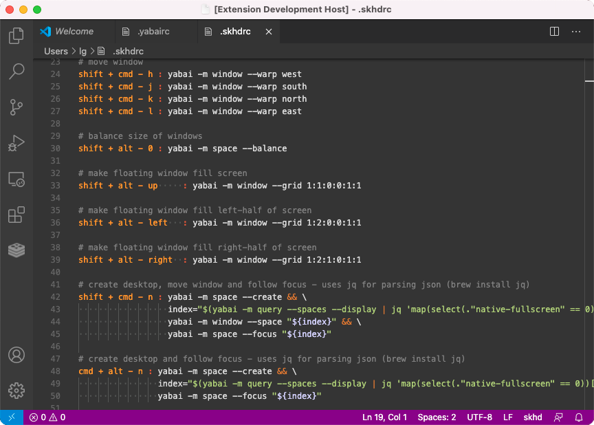

# skhd Highlighter

_(color theme is Afterglow Remastered)_

Install this extension to do syntax highlighting for key presses and commands with skhd (that you're probably likely also using with yabai). Note I'm not the guy who made skhd or yabai, I just like colors.

## Installing

If you're getting this extension via source code, put this directory into your `~/.vscode/extensions` directory. Then start VSCode and open up your `.skhdrc` file. Colors should ensue!

## Todo

- Implement Yabai highlighting in here too
- Instead of using the string formatting, use shell formatting, but be careful about the line break `\` character
- Use the full-on tokenized stuff Asmund [details for us](https://github.com/koekeishiya/skhd#configuration)

## Changelog

### 1.0.0 (Nov 18, 2020)

- Initial release with simple command format